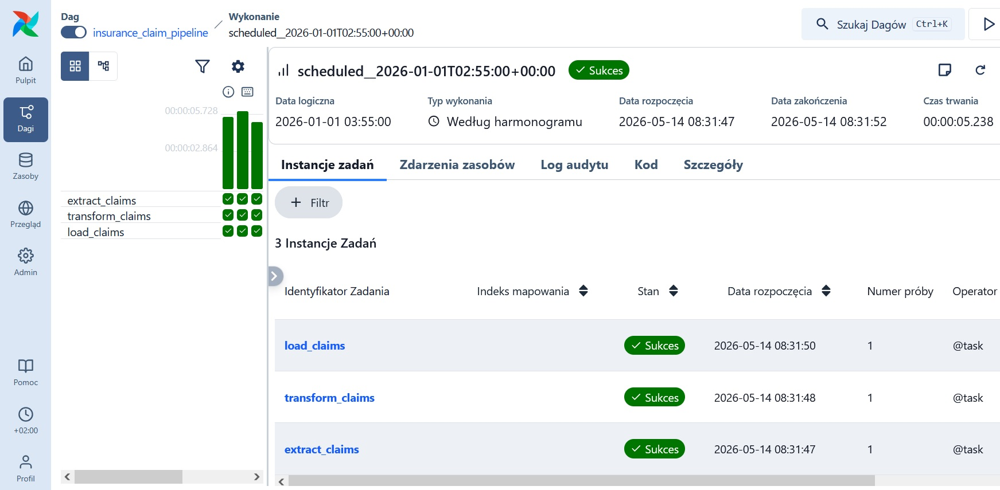
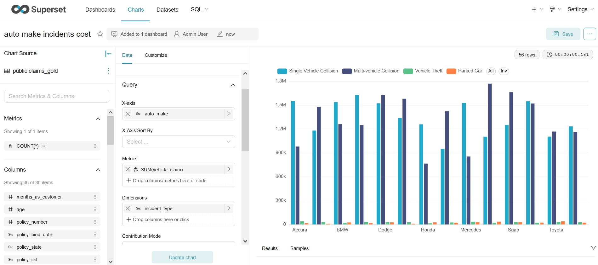

# Auto Insurance Claims Pipeline

A data engineering project that processes auto insurance claims through a medallion architecture (bronze -> silver -> gold).
Each claim is normalized, verified against OWU PZU Auto business rules, and enriched with approval status and payout amount.
Processed data is stored in PostgreSQL and visualized with Apache Superset dashboard.

## Stack
- Python 3.14
- Apache Airflow
- Apache Superset
- PostgreSQL
- DuckDB

## How it works
1. Airflow DAG fetches raw claims data from Kaggle
2. Bronze layer - raw data stored as-is
   - data source: https://www.kaggle.com/datasets/buntyshah/auto-insurance-claims-data
   - note: dataset is synthetic and based on US market, not directly applicable to Polish insurance market
3. Silver layer - data normalized and cleaned
4. Gold layer - claims processed using simplified business rules inspired by OWU PZU Auto:
   - claim approval status determined with rejection reasons
   - payout amount calculated if approved
   - note: rules are simplified and adapted to available data, not a 1:1 implementation of OWU PZU
   - source: https://rezerwacja.cargogroup.pl/resources/data/forms/artykuly/9/OWU_PZU.pdf
5. Results stored in PostgreSQL
6. Apache Superset displays claims dashboard

## How to run
### Prerequisites
- Docker & Docker Compose
- set python 3.14 virutal env
- install dependencies:
```bash
pip install --no-cache-dir -r requirements.txt
```

### Tests
```bash
pytest -s tests/
```

### Local pipeline verification
```bash
pip install --no-cache-dir -r requirements.txt
python -m src.main
```

### Start with Docker
```bash
docker-compose up -d --build
```

### Apache Airflow guide
can enter with http://localhost:8080 \
To get login credentials, check the container logs: 

```bash
docker logs insurance-claims-pipeline-airflow-1 | Select-String "Simple auth manager"
```
From the UI you can trigger and monitor the `insurance_claim_pipeline` DAG.



### Apache Superset guide
can enter with http://localhost:8088 \
credentials: \
username: admin \
password: admin

To get started, navigate to Datasets and create a new dataset by selecting `claims-db` database and `claims_gold` table. 
Then you can go to Charts to build your first visualization based on the data.



